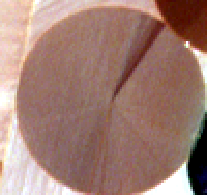
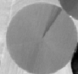
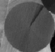
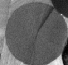
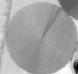
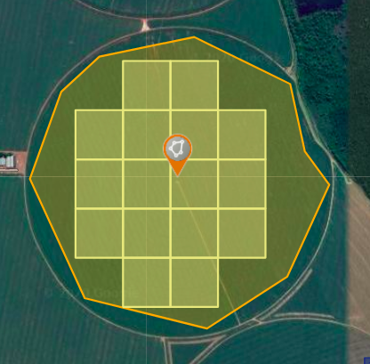

## Goal

An academic project to collect satellite images of farms with active corn crops and use artificial intelligence to recognise that crop in other images — classifying which farms have corn planted.

## Materials and methods

The algorithms were written in **Python**, using deep learning libraries for convolutional neural networks (**CNN**).

**QGIS** (a geographic information system for viewing, editing and analysing georeferenced data) was used to extract spectral bands and inspect the maps downloaded from **INPE** (Brazil's National Institute for Space Research).

Images came from the **CBERS-3** satellite's **MUX** sensor (Regular Multispectral Camera): 20-metre resolution, 4 spectral bands plus a panchromatic one (on the CCD). Its 120 km swath suits municipal and regional studies, and its 26-day revisit supports analysing phenomena of compatible duration — improvable thanks to the CCD's side-looking capability. The bands cover the visible and near-infrared range, giving good contrast between vegetation and other objects.

Images were processed at level **L4**: orthorectified, with radiometric correction and geometric correction refined by ground control points and a digital elevation model.

## Execution

Once the corn fields were located, we collected their images in 4 spectral ranges: blue, green, red and near-infrared.

The images were then split into tiles to train the deep learning network. Since data collection and cleaning drive the result, we spent a large share of the time on those algorithms, aiming for a satisfactory accuracy rate.

## Next steps

A possible evolution is to combine the images with each region's **NDVI**, using tools and databases such as **SATVeg** to get the NDVI history of every point on the map:

")

That would enable a new NDVI-based classification feature.
